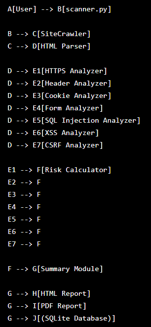
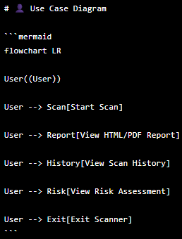
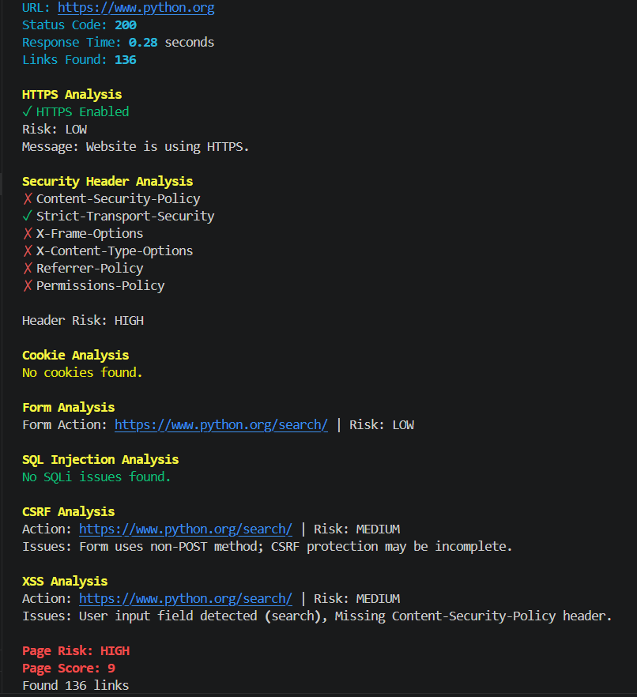
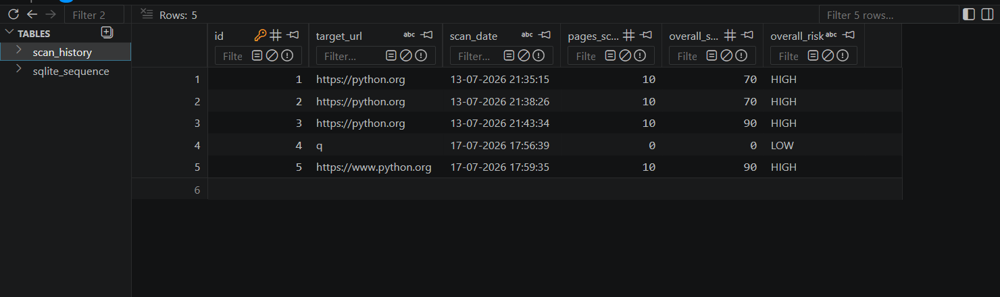

# 🛡️ Rule-Based Web Vulnerability Scanner

A modular Python-based web vulnerability scanner that performs rule-based security analysis on websites by crawling pages, extracting forms, and detecting common web security issues.

The scanner generates HTML and PDF reports, stores scan history in SQLite, and provides an overall security risk assessment.

---

# Features

- Multi-page website crawling (BFS)
- HTML parsing using BeautifulSoup
- HTTPS security analysis
- HTTP Security Header analysis
- Cookie security analysis
- HTML Form analysis
- SQL Injection detection (Rule-Based)
- Cross-Site Scripting (XSS) detection
- Cross-Site Request Forgery (CSRF) detection
- Overall Risk Score calculation
- HTML Report generation
- PDF Report generation
- SQLite database for scan history
- Rich console interface
- Modular architecture

---

# Project Structure

```
RuleBasedScanner/

├── analyzer/
│   ├── cookies.py
│   ├── csrf.py
│   ├── forms.py
│   ├── headers.py
│   ├── https_analyzer.py
│   ├── sqli.py
│   └── xss.py
│
├── crawler/
│
├── database/
│
├── docs/
│
├── output/
│   ├── reports/
│   └── scanner.db
│
├── reports/
│
├── tests/
│
├── utils/
│
├── scanner.py
├── config.py
├── requirements.txt
└── README.md
```

---

# System Architecture


---

# Workflow



---

# Use Case Diagram



---

# Class Diagram


---

# Technologies Used

| Technology | Purpose |
|------------|---------|
| Python 3 | Core Programming Language |
| Requests | HTTP Communication |
| BeautifulSoup4 | HTML Parsing |
| Rich | Console Interface |
| SQLite3 | Scan History Database |
| ReportLab | PDF Report Generation |
| HTML/CSS | HTML Report |

---

# Installation

Clone the repository

```bash
git clone https://github.com/YOUR_USERNAME/RuleBasedScanner.git

cd RuleBasedScanner
```

Create virtual environment

```bash
python -m venv .venv
```

Activate virtual environment

### Windows

```bash
.venv\Scripts\activate
```

### Linux / macOS

```bash
source .venv/bin/activate
```

Install dependencies

```bash
pip install -r requirements.txt
```

---

# Usage

Run the scanner

```bash
python scanner.py
```

Enter target URL

```
https://example.com
```

---

# Generated Output

The scanner generates

- Console Summary
- HTML Report
- PDF Report
- SQLite Scan History

Reports are saved in

```
output/reports/
```

Database

```
output/scanner.db
```

---

# Screenshots

## Console Interface



---

## HTML Report


---

## PDF Report


---

## SQLite Scan History



---

# Vulnerability Checks

The scanner performs the following analyses.

## HTTPS Analysis

Checks whether HTTPS is enabled.

---

## Security Headers

Checks for

- Content-Security-Policy
- Strict-Transport-Security
- X-Frame-Options
- X-Content-Type-Options
- Referrer-Policy
- Permissions-Policy

---

## Cookie Analysis

Checks

- Secure Flag
- HttpOnly
- SameSite

---

## Form Analysis

Checks

- Password fields
- GET method usage
- Missing action attribute
- HTTP form submission

---

## SQL Injection

Detects suspicious input parameters using rule-based analysis.

---

## Cross-Site Scripting (XSS)

Detects user input fields and missing Content-Security-Policy headers.

---

## Cross-Site Request Forgery (CSRF)

Detects forms without CSRF protection mechanisms using rule-based analysis.

---

# Risk Levels

The scanner classifies findings into

- LOW
- MEDIUM
- HIGH

An overall risk score is calculated after each scan.

---

# Testing

The scanner should only be tested on authorized targets.

Example targets

- OWASP WebGoat
- OWASP Juice Shop
- PortSwigger Web Security Academy Labs
- https://example.com
- https://python.org

---

# Limitations

- Rule-based detection only
- Does not exploit vulnerabilities
- Does not bypass authentication
- No JavaScript rendering
- No authenticated crawling
- Intended for educational and authorized testing only

---

# Future Improvements

- Async crawler
- CVSS scoring
- JSON export
- CSV export
- Docker support
- REST API
- Authentication support
- Scheduled scanning
- Additional OWASP Top 10 checks

---

# Ethical Use

This project is intended for educational purposes and authorized security testing only.

Only scan systems that you own or have explicit permission to test.

Unauthorized scanning may violate applicable laws or terms of service.

---

# License

This project is licensed under the MIT License.

---

# Author

**Varnit Goyal**

Computer Science Engineer

Cyber Security Enthusiast